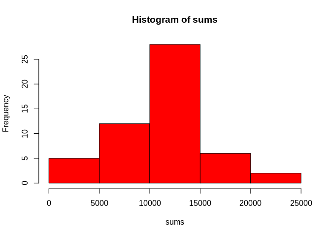
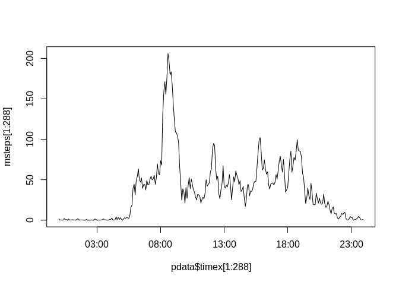
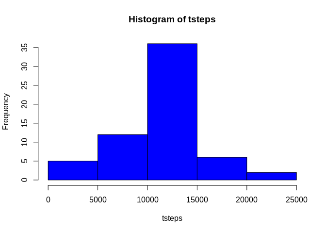
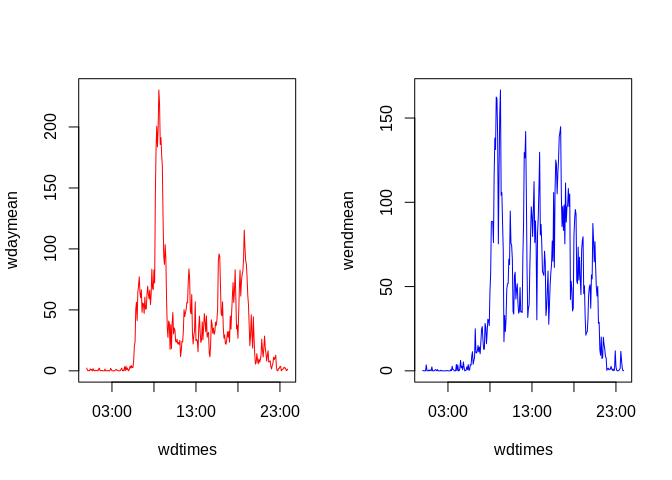

## Loading and preprocessing the data

```r
library(chron)
```

```
## NOTE: The default cutoff when expanding a 2-digit year
## to a 4-digit year will change from 30 to 69 by Aug 2020
## (as for Date and POSIXct in base R.)
```

```r
rawdata<-read.csv(unz("activity.zip", "activity.csv"))
rawdata$fd<-factor(rawdata$date)
pdata<-subset(rawdata, !is.na(rawdata$steps))
 hours<-0:23
 mins<-c(0,5,10,15,20,25,30,35,40,45,50,55)
 pdata$time=0
 i<-1
for (j in 1:53) {
  
     for (k in seq_along(hours)) {
         for (l in seq_along(mins)) {
             pdata$time[i]<-paste(hours[k],mins[l],sep = ":")
             
             i<-i+1
             
         }
     
     }
  }
 pdata$time<-chron(times. = paste(pdata$time[1:288],':',0))
 pdata$time<-factor(pdata$time)
```

## What is mean total number of steps taken per day?

```r
sums<-tapply(pdata$steps, pdata$fd, sum)
hist(sums, col = "Red")
```

<!-- -->

```r
sm<-as.integer(mean(sums,na.rm = TRUE))
smd<-median(sums, na.rm = TRUE)
```
Mean is 10766  
Median is 10765

## What is the average daily activity pattern?


```r
pdata$timex<-as.POSIXct(pdata$time, format = "%H:%M:%S",tz="UTC")
msteps<-tapply(pdata$steps,pdata$timex,mean)
plot(pdata$timex[1:288],msteps[1:288],type = "l")
```

<!-- -->

```r
timev<-pdata$time[1:288]
max<-as.vector(timev[msteps==max(msteps)])
```
Interval with maximum mean steps is 08:35:00


## Imputing missing values

```r
nav<-rawdata$steps[is.na(rawdata$steps)]
navn<-length(nav)
cdata<-rawdata
for (v in seq_along(cdata$steps)) {
    if(is.na(cdata$steps[v])){
        mod<-v%%288
        if(mod==0){mod<-288}
    cdata$steps[v]<-msteps[mod]
    }
}
tsteps<-tapply(cdata$steps, cdata$date, sum)
hist(tsteps,col = "blue")
```

<!-- -->

```r
meants<-as.integer(mean(tsteps))
medts<-as.integer(median(tsteps))
```
Number of NA values is 2304  
Mean total steps per day is 10766  
Median total steps per day is 10766 
The mean and median values are more or less the same.


## Are there differences in activity patterns between weekdays and weekends?

```r
cdata$fd<-as.Date(cdata$date, format="%Y-%m-%d")
cdata$weekday<-weekdays(cdata$fd)
cdata$weekday <- factor((weekdays(cdata$fd) %in% c("Monday","Tuesday","Wednesday","Thursday","Friday")), levels=c(FALSE, TRUE), labels=c('Weekend', 'Weekday') )
cdata$time=0
  i<-1
 for (j in 1:53) {
   
      for (k in seq_along(hours)) {
          for (l in seq_along(mins)) {
              cdata$time[i]<-paste(hours[k],mins[l],sep = ":")
              
              i<-i+1
              
          }
      
      }
   }
  cdata$time<-chron(times. = paste(cdata$time[1:288],':',0))
cdata$time<-factor(cdata$time)
cdata$timex<-as.POSIXct(cdata$time, format = "%H:%M:%S",tz="UTC")
wdaymean<-tapply(cdata$steps[cdata$weekday=="Weekday"], cdata$timex[cdata$weekday=="Weekday"], mean)
wendmean<-tapply(cdata$steps[cdata$weekday=="Weekend"], cdata$timex[cdata$weekday=="Weekend"], mean)
wdtimes<-cdata$timex[1:288]
par(mfrow=c(1,2))
 plot(wdtimes,wdaymean,type = "l", col="Red")
 plot(wdtimes,wendmean,type = "l", col="Blue")
```

<!-- -->
